**Prerequisite: Refer to Andrew Ng's course**

## How to overcome local minima (What about local minima?: Video 31)

During gradient descent, the model may get stuck at local minima. How to overcome it?

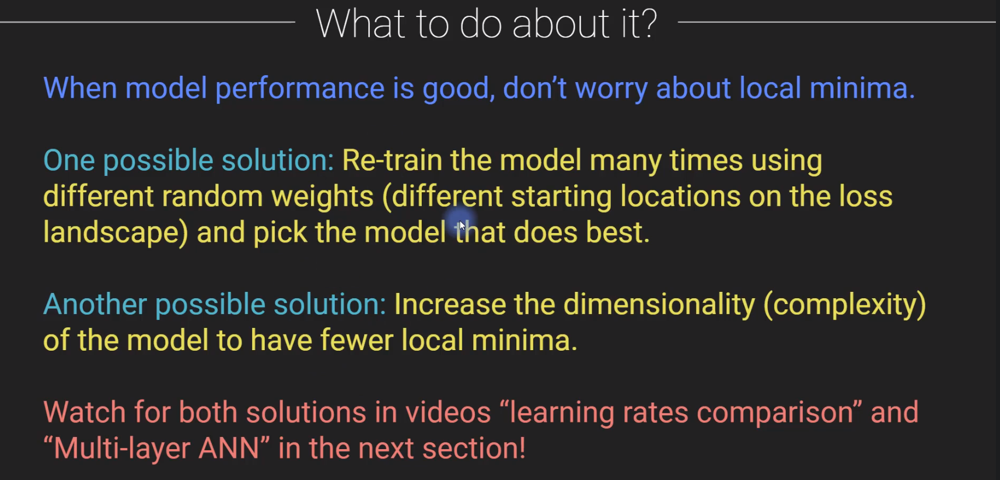

## Gradient descent on python, and matplotlib (Gradient descent in 1D: Video 32)

Jupyter notebook:

```python
import numpy as np
import matplotlib.pyplot as plt

import matplotlib_inline
matplotlib_inline.backend_inline.set_matplotlib_formats('svg')

import sympy as sym
```

```python
def fx(x):
    return 3*x**2 - 3*x + 4

def deriv(x):
    return 6*x - 3
```

```python
fig, ax = plt.subplots()
x = np.linspace(-2, 2, 2001)
ax.plot(x, fx(x), x, deriv(x))
ax.set(xlabel='x', ylabel='f(x)')
ax.legend(['y', 'd(y)'])
ax.axhline(y=0, linestyle='--', color='gray')
plt.show()
```

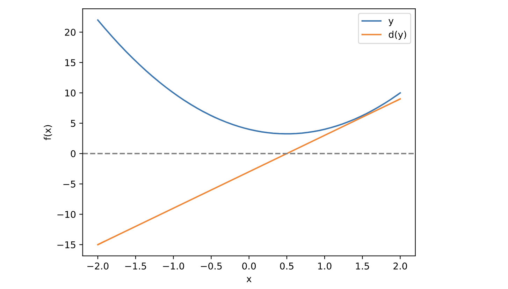

On the cell above, we see dy/dx = 0, when x =0.5, which is the minima of the curve, and the cell below figure this minima out with gradient descent

```python
# storing points to plot graph
grads_store = []
local_min_store = []
it_store = []
def store_to_array_for_graph(local_min, it):
    local_min_store.append(local_min)
    grads_store.append(deriv(local_min))
    it_store.append(it)


# random starting point
local_min = np.random.choice(x, 1) # 1 random x value
print(f"initial random x guess for minima: {local_min}")

# learning parameters
learning_rate = 0.01
training_epochs = 100

store_to_array_for_graph(local_min[0], 0) # storing just to plot the graph later

# run through training, implements gradient descent
for i in range(training_epochs):
    grad = deriv(local_min)
    local_min = local_min - learning_rate * grad

    store_to_array_for_graph(local_min[0], i) # storing just to plot the graph later
print(f'final approximation of minima after gradient descent: {local_min}')
```

initial random x guess for minima: [1.026]
final approximation of minima after gradient descent: [0.50108086]

We can see below, that at first it takes big steps, but later on, it starts to taking smaller and smaller steps

```python
fig, (ax0, ax1) = plt.subplots(ncols=2, figsize=(10, 5))

ax0.plot(it_store, local_min_store, 'o-')
ax0.set(xlabel='Iteration', ylabel='Local Minima')

ax1.plot(it_store, grads_store, 'o-')
ax1.set(xlabel='Iteration', ylabel='Derivative')
plt.show()
```

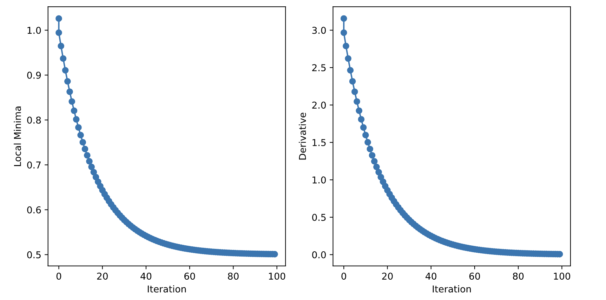

## Gradient descent in python (Gradient descent in 2D: Video 34)

Jupyter notebook (continuation):

```python
# the "peaks" function
def peaks(x,y):
  # expand to a 2D mesh
  x,y = np.meshgrid(x,y)

  z = 3*(1-x)**2 * np.exp(-(x**2) - (y+1)**2) \
      - 10*(x/5 - x**3 - y**5) * np.exp(-x**2-y**2) \
      - 1/3*np.exp(-(x+1)**2 - y**2)
  return z
```

One the graph, the deeper purple corresponds to global minima, lighter purple corresponds to local minima, darker yellow corresponds to global maxima, and the lighter yellow corresponds to local maxima

```python
# create the landscape
x = np.linspace(-3, 3, 201)
y = np.linspace(-3, 3, 201)

Z = peaks(x, y)

plt.imshow(Z, extent=[x[0], x[-1], y[0], y[-1]], vmin=-5, vmax=5, origin='lower')
plt.show()
```

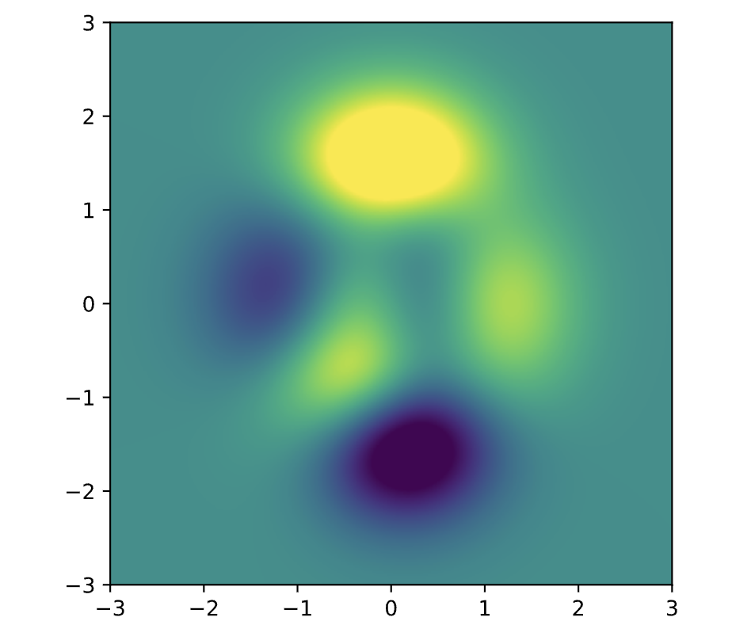

creating the function again for sympy to calculate the derivative. The graph above just represents the graph

```python
sx, sy = sym.symbols('sx, sy')
sZ = 3*(1-sx)**2 * sym.exp(-(sx**2) - (sy+1)**2) \
      - 10*(sx/5 - sx**3 - sy**5) * sym.exp(-sx**2-sy**2) \
      - 1/3*sym.exp(-(sx+1)**2 - sy**2)

# derivatives
# function is in 2-dim, so there are 2 'partial' derivatives along each 2 axes
# lamdify converts sympy obj to numpy func
df_x = sym.lambdify((sx, sy), sym.diff(sZ, sx), 'sympy')
df_y = sym.lambdify((sx, sy), sym.diff(sZ, sy), 'sympy')

df_x(1, 1).evalf()
```

−1.07369833656079

```python
grads_store = []
local_min_store = []
it_store = []
def store_to_array_for_graph(local_min, it):
    local_min_store.append(local_min)
    grads_store.append(deriv(local_min))
    it_store.append(it)


# 2 random starting value between -2 and 2 for the 2-dims
local_min = np.random.rand(2)*4-2
start_pnt = local_min[:] # copies local_min to here
# store_to_array_for_graph(local_min[0], 0) # storing just to plot the graph later

learning_rate = 0.01
training_epochs = 1000
trajectory = np.zeros((training_epochs,2))
for i in range(training_epochs):
    grad = np.array([df_x(local_min[0], local_min[1]).evalf(),
                     df_y(local_min[0], local_min[1]).evalf()
                    ])
    local_min = local_min - learning_rate * grad
    trajectory[i,:] = local_min

print(f"initial random x guess for minima: {start_pnt}")
print(f'final approximation of minima after gradient descent: {local_min}')
```

initial random x guess for minima: [ 1.74178471 -1.96541217]
final approximation of minima after gradient descent: [0.228278920556369 -1.62553495750000]

```python
plt.imshow(Z, extent=[x[0], x[-1], y[0], y[-1]], vmin=-5, vmax=5, origin='lower')
# plot as dots starting and end locations
plt.plot(start_pnt[0], start_pnt[1], 'bs')
plt.plot(local_min[0], local_min[1], 'ro')
plt.plot(trajectory[:,0], trajectory[:,1], 'r')
plt.legend(['random start', 'local min'])
plt.colorbar()
plt.show()
```

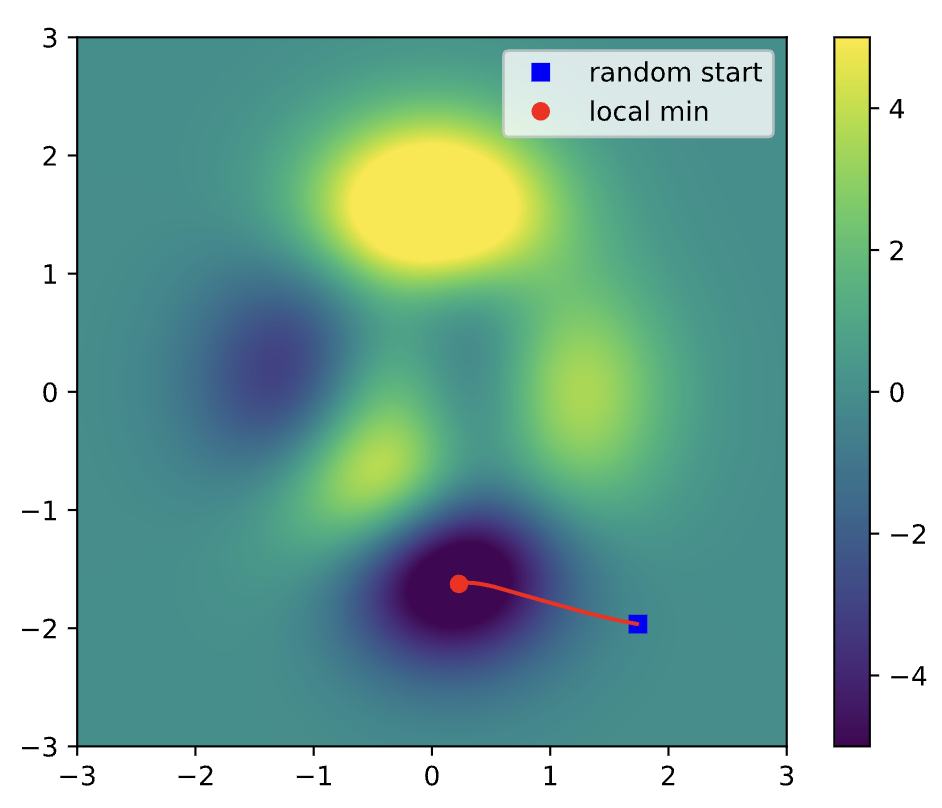


## Running several experiments to observe how learning rate, training epochs, and starting minima guess affect gradient descent result (Parametric experiments on g.d.: Video 36)

just for plotting how the function has global minima to later estimate it by gradient descent

Jupyter notebook (continuation):

```python
x = np.linspace(-2*np.pi, 2*np.pi, 401)
fx = np.sin(x) * np.exp(-x**2*0.05) # equation
df = np.cos(x)*np.exp(-x**2*.05) + np.sin(x)*(-.1*x)*np.exp(-x**2*.05) # derivative
fig, ax = plt.subplots()
ax.plot(x, fx, x, df)
ax.legend(['f(x)', 'df'])
plt.show()
```

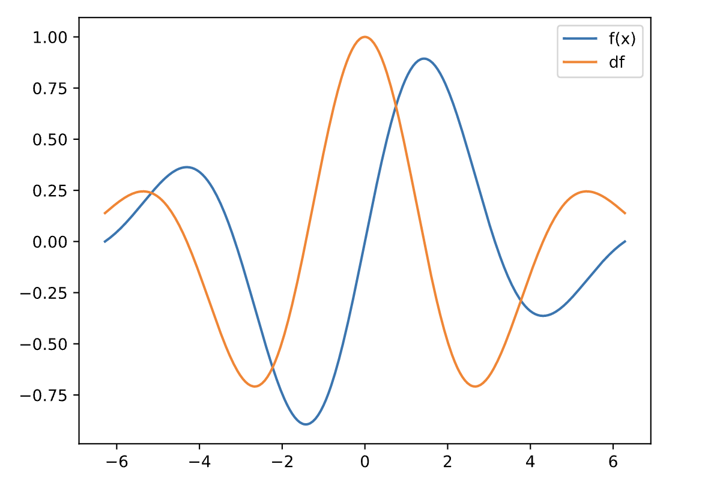

Doing gradient descent from 1 starting locations

```python
def fx(x):
    return np.sin(x) * np.exp(-x**2*0.05) # equation
def deriv(x):
    return np.cos(x)*np.exp(-x**2*.05) + np.sin(x)*(-.1*x)*np.exp(-x**2*.05) # derivative
```

```python
local_min = np.random.choice(x, 1)

# learning parameters
learning_rate = 0.01
training_epochs = 1000

for i in range(training_epochs):
    grad = deriv(local_min)
    local_min = local_min - learning_rate * grad
local_min
```

array([4.29860753])

**Experiment 1:** Doing gradient descent on various starting locations, to understand where the minima stands. We observe based on the starting locations, the algorithm can stand on local minima or sometimes on the global minima

```python
# having several starting locations to do gradient descent on
start_locs = np.linspace(-5, 5, 50)
final_res = np.zeros(len(start_locs))

# to loop through the indices and the values of start_locs, using enumerate(start_locs) 
for idx, local_min in enumerate(start_locs):
    for i in range(training_epochs):
        grad = deriv(local_min)
        local_min = local_min - learning_rate*grad
    # store the final minima gotten by gradient descent for plotting graph
    final_res[idx] = local_min 
fig, ax = plt.subplots()
ax.plot(start_locs, final_res, 's-')
ax.set(xlabel="Starting guess", ylabel="Predicted minima")
plt.show()
```

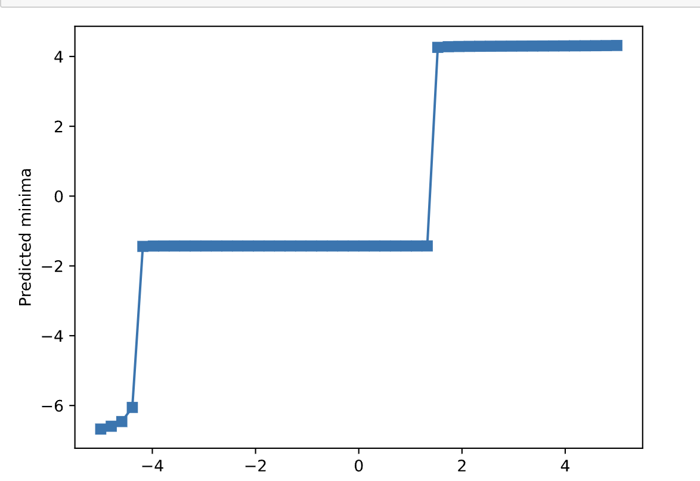

**Experiment 2:** systematically varying the learning rate

**Observation:** when the learning rate is tiny, it takes such tiny steps that it does not minimize the minima at all, and as soon as learning rate is higher, it gets to the optimal result i.e the global minima

```python
learning_rates = np.linspace(1e-10, 1e-1, 50)
final_res = np.zeros(len(learning_rates))

for idx, learning_rate in enumerate(learning_rates):
    # force starting guess to 0
    local_min = 0
    # gradient descent
    for i in range(training_epochs):
        grad = deriv(local_min)
        local_min = local_min - learning_rate * grad
    # storing to plot the graph
    final_res[idx] = local_min

fig, ax = plt.subplots()
ax.plot(learning_rates, final_res, 's-')
ax.set(xlabel="Learning rate", ylabel="Predicted minima")
plt.show()
```

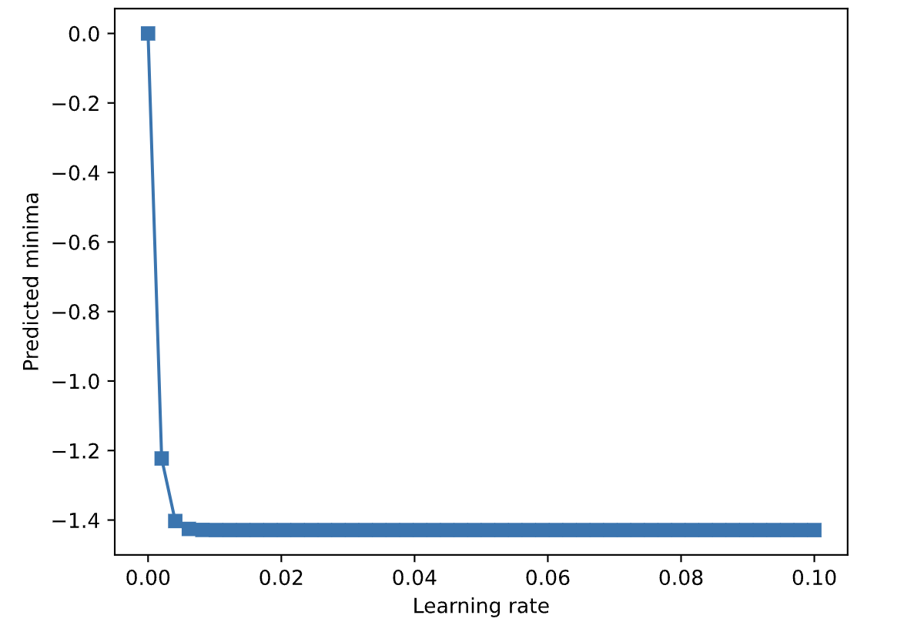

**Experiment 3:** interaction between learning rates and training epochs

**Observation:** the blue is good, and the yellow is not good, so we see for example, when the learning is too small, and the training epochs is small, then the yellow indicates as failure

```python
learning_rates = np.linspace(1e-10,1e-1,50)
training_epochs = np.round(np.linspace(10,500,40))

# initialize matrix to store results for graph
final_res = np.zeros(( len(learning_rates), len(training_epochs) ))

# loop over learning rates
for lidx, learning_rate in enumerate(learning_rates):
    # loop over training epochs
    for eidx, training_epoch in enumerate(training_epochs):
        # gradient descent with fixed starting guess
        local_min = 0
        for i in range(int(training_epoch)):
            grad = deriv(local_min)
            local_min = local_min - learning_rate * grad
        final_res[lidx, eidx] = local_min

# graph
fig,ax = plt.subplots(figsize=(7,5))

plt.imshow(final_res,extent=[learning_rates[0],learning_rates[-1],training_epochs[0],training_epochs[-1]],
           aspect='auto',origin='lower',vmin=-1.45,vmax=-1.2)
plt.xlabel('Learning rate')
plt.ylabel('Training epochs')
plt.title('Final guess')
plt.colorbar()
plt.show()
```

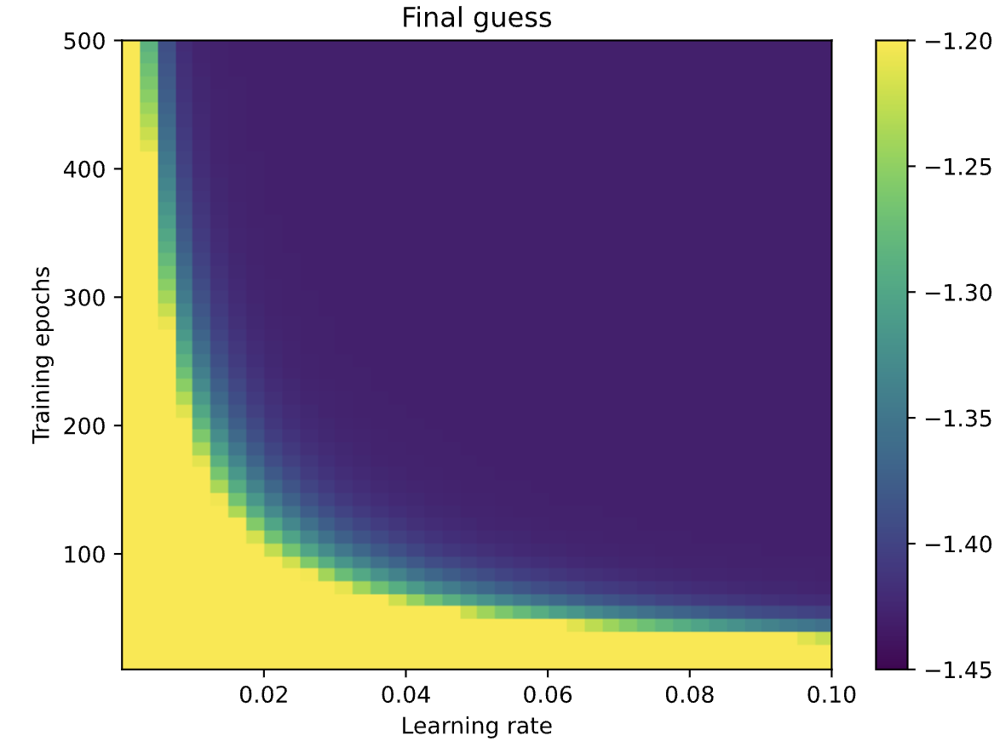

## Changing the learning rate as gradient descent progresses (CodeChallenge: fixed vs. dynamic learning rate: Video 37)

So far, we used a fixed learning rate, but this section explores of changing the learning rate dynamically during gradient descent.

It is helpful because when we are too close to the solution, we do need to take large steps, so changing the learning rate is a good call, otherwise we will take too large steps, and never reach the minima

Jupyter notebook (continuation):

```python
# storing points to plot graph
grads_store = []
local_min_store = []
it_store = []
lr_store = []
def store_to_array_for_graph(local_min, it, lr):
    local_min_store.append(local_min)
    grads_store.append(deriv(local_min))
    it_store.append(it)
    lr_store.append(lr)

def fx(x):
    return 3*x**2 - 3*x + 4

def deriv(x):
    return 6*x - 3

# random starting point
x = np.linspace(-2, 2, 2001)


# random starting point
local_min = np.random.choice(x, 1) # 1 random x value
print(f"initial random x guess for minima: {local_min}")

# learning parameters
learning_rate = 0.01
training_epochs = 100

store_to_array_for_graph(local_min[0], 0, learning_rate) # storing just to plot the graph later

# run through training, implements gradient descent
for i in range(training_epochs):
    grad = deriv(local_min)
    local_min = local_min - learning_rate * grad

    store_to_array_for_graph(local_min[0], i, learning_rate) # storing just to plot the graph later
print(f'final approximation of minima after gradient descent: {local_min}')
```

initial random x guess for minima: [1.28]
final approximation of minima after gradient descent: [0.5016028]

**Method 1:** gradient descent using a gradient-based learning rate

So why `lr = learning_rate * np.abs(grad)`?

That is because when we are very far to the minima, then gradient is large, so multiply the learning rate by it, and the lr is also large, taking a large step since we are far. Alternatively, when we are close, then the gradient is small, and lr is altered to be small, taking small steps close to the solution

```python
# storing points to plot graph
grads_store_1 = []
local_min_store_1 = []
it_store_1 = []
lr_store_1 = []
def store_to_array_for_graph(local_min, it, lr):
    local_min_store_1.append(local_min)
    grads_store_1.append(deriv(local_min))
    it_store_1.append(it)
    lr_store_1.append(lr)

local_min = np.random.choice(x, 1) # 1 random x value
print(f"initial random x guess for minima: {local_min}")

# learning parameters
learning_rate = 0.01
training_epochs = 100

store_to_array_for_graph(local_min[0], 0, learning_rate) # storing just to plot the graph later

# run through training, implements gradient descent
for i in range(training_epochs):
    # np.abs because if not it becomes -lr when grad(-ve), implementing gradient ascent not descent
    lr = learning_rate * np.abs(grad)
    grad = deriv(local_min)
    local_min = local_min - lr * grad

    store_to_array_for_graph(local_min[0], i, lr) # storing just to plot the graph later
print(f'final approximation of minima after gradient descent: {local_min}')
```

initial random x guess for minima: [-1.678]
final approximation of minima after gradient descent: [0.47894098]

**Method 2:** gradient descent using a time-based learning rate

```python
# storing points to plot graph
grads_store_2 = []
local_min_store_2 = []
it_store_2 = []
lr_store_2 = []
def store_to_array_for_graph(local_min, it, lr):
    local_min_store_2.append(local_min)
    grads_store_2.append(deriv(local_min))
    it_store_2.append(it)
    lr_store_2.append(lr)
    
# random starting point
x = np.linspace(-2, 2, 2001)
local_min = np.random.choice(x, 1) # 1 random x value
print(f"initial random x guess for minima: {local_min}")

# learning parameters
learning_rate = 0.01
training_epochs = 100

store_to_array_for_graph(local_min[0], 0, learning_rate) # storing just to plot the graph later

# run through training, implements gradient descent
for i in range(training_epochs):
    # np.abs because if not it becomes -lr when grad(-ve), implementing gradient ascent not descent
    lr = learning_rate * (1 - (i+1)/training_epochs)
    grad = deriv(local_min)
    local_min = local_min - lr * grad

    store_to_array_for_graph(local_min[0], i, lr) # storing just to plot the graph later
print(f'final approximation of minima after gradient descent: {local_min}')
```

initial random x guess for minima: [1.586]
final approximation of minima after gradient descent: [0.55242185]

```python
fig, (ax0, ax1, ax2) = plt.subplots(1, 3, figsize=(10, 3), gridspec_kw={"width_ratios":[1, 1, 1]})
ax0.plot(it_store, local_min_store, 'o-', 
         it_store_1, local_min_store_1, 'o-',
         it_store_2, local_min_store_2, 'o-', markerfacecolor='w')
ax1.plot(it_store, grads_store, 'o-', 
         it_store_1, grads_store_1, 'o-',
         it_store_2, grads_store_2, 'o-', markerfacecolor='w')
ax2.plot(it_store, lr_store, 'o-', 
         it_store_1, lr_store_1, 'o-',
         it_store_2, lr_store_2, 'o-', markerfacecolor='w')

ax0.set_ylabel('Local minimum')
ax1.set_ylabel('Derivative')
ax2.set_ylabel('Learning rate')
ax2.legend(['Fixed l.r.','Grad-based l.r.','Time-based l.r.'])
plt.tight_layout()
plt.show()
```

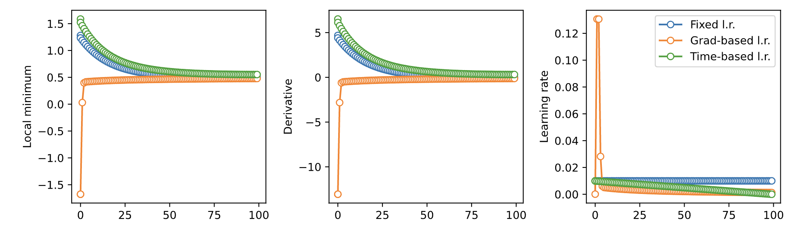

## Problems & solutions of gradient descent (Vanishing and exploding gradients: Video 38)

Gradient descent problems:

* Vanishing gradient: The curve has like a flat line, so the gradient becomes close to 0, and the model starts taking very little steps, soon the training time is over, and the model never reaches the global minima

* Exploding gradient: There is a very steep slope, so the gradient is very large, so the model takes a very large step, and keeps on taking these large steps due to that steep slope, never reaching the minima.

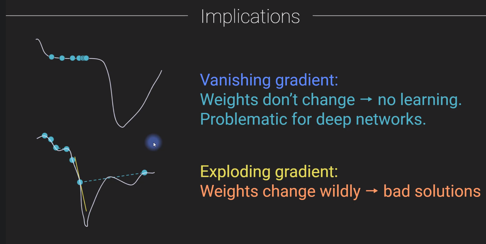

Some solutions to be explored in later sections:

* Use models with few hidden layers

* Use activation functions that do not saturate e.g RELU

* Apply weight normalization

* Pre-train networks using auto encoders.

* Use regularization techniques like batch normalization, dropout and weight decay

* Use architectures like residual networks, resnet.
