## (Terms and datatypes in math and computers: Video 14)

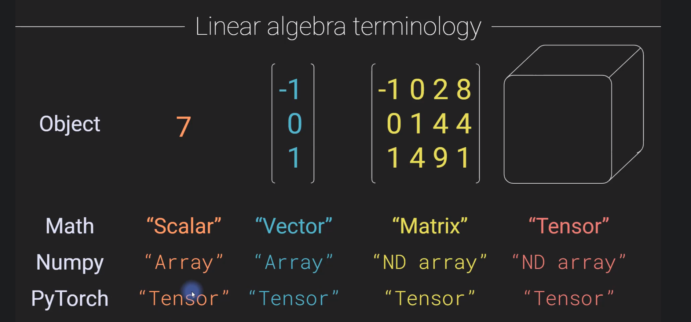

Matrices are represented as: number of rows X number of columns

## How to do transpose on numpy and PyTorch? (Vector and matrix transpose: Video 16)

Transpose just turns columns to rows and vice versa on matrices and vectors. 

Remember vectors are just matrices **with** one column (n X 1) **OR** one row (1 X n).

Jupyter Notebook:

```python
import numpy as np
import torch
import torch.nn as nn
import torch.nn.functional as F
import matplotlib.pyplot as plt
import scipy.stats as stats
import sympy as sym # only used for next 2 sections and gradient descent section
import sympy.plotting.plot as symplot
# notebook's library (no need to install anything) to display equations nicely
from IPython.display import display 
```

Using numpy

```python
matrix = np.array([[1,2,3,4], [5,6,7,8]])
matrix, matrix.T
```

(array([[1, 2, 3, 4],
        [5, 6, 7, 8]]),
 array([[1, 5],
        [2, 6],
        [3, 7],
        [4, 8]]))

Using Pytorch

```python
matrix = torch.tensor([[1,2,3,4], [5,6,7,8]])
matrix, matrix.T
```

(tensor([[1, 2, 3, 4],
         [5, 6, 7, 8]]),
 tensor([[1, 5],
         [2, 6],
         [3, 7],
         [4, 8]]))

## Dot product implementation in math, Numpy, and Pytorch (OMG it's the dot product!: Video 17)

Dot product notations:

$\alpha = a.b=<a,b>=a^Tb=\sum^n_{i=1}a_ib_i$

To have a dot product between 2 matrices /vectors: 

* they have to have the same length (same number of rows and same number of columns in each matrices/vectors).

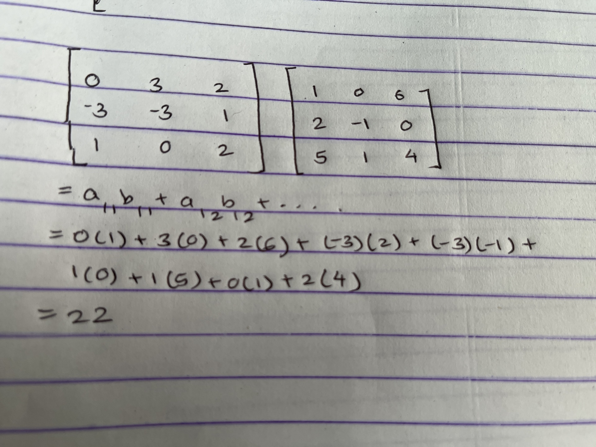

Dot product is always a single number.

Jupyter Notebook (continuation):

```python
matA = np.array([[0,3,2], [-3,-3,1], [1,0,2]])
matB = np.array([[1,0,6], [2,-1,0], [5,1,4]])
print(np.sum(matA * matB)) # Output: 22


matA = torch.tensor([[0,3,2], [-3,-3,1], [1,0,2]])
matB = torch.tensor([[1,0,6], [2,-1,0], [5,1,4]])
torch.sum(matA * matB) # Output: tensor(22)


matA = torch.tensor([[0,3,2]])
matB = torch.tensor([[1,0,6]])
torch.sum(matA * matB) # Output: tensor(12)


matA = np.array([[0,3,2]])
matB = np.array([[1,0,6]])
np.sum(matA * matB) # Output: 12
```

## Matrix multiplication on math, numpy, and pytorch (Matrix multiplication: Video 18)

For matrices to be multiplied:

* Number of columns in first matrix = number of rows in second matrix

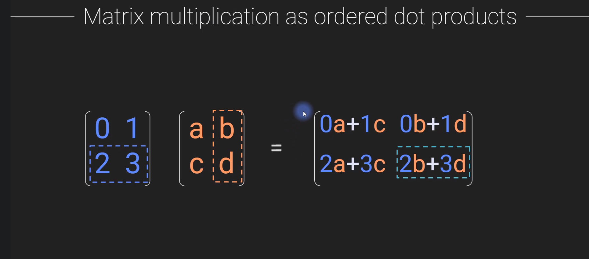

Jupyter Notebook (continuation):

```python
nMatA = np.array([[0,3,2], [-3,-3,1], [1,0,2]])
nMatB = np.array([[1,0,6], [2,-1,0], [5,1,4]])
nMatA@nMatB
```

array([[ 16,  -1,   8],
       [ -4,   4, -14],
       [ 11,   2,  14]])

```python
matA = torch.tensor([[0,3,2], [-3,-3,1], [1,0,2]])
matB = torch.tensor([[1,0,6], [2,-1,0], [5,1,4]])
matA@matB
```

tensor([[ 16,  -1,   8],
        [ -4,   4, -14],
        [ 11,   2,  14]])

```python
# Multiplying numpy matrix and pytoch matrix does not work
# so being converted to have it work
nMatA = np.random.randn(3, 4) # matrix of random elements 3 rows X 4 cols
pMatB = torch.randn(4, 7) # matrix of random elements 4 rows X 7 cols
torch.tensor(nMatA, dtype=torch.float)@pMatB
```

tensor([[ 0.9503, -0.2606, -1.6271, -0.6396, -1.9935, -0.8688,  0.0842],
        [-0.6538,  0.9442,  1.4935,  3.3054,  1.8604,  1.7342,  0.5933],
        [-1.3668, -0.5387,  0.7912, -0.8677,  0.5002, -0.3309, -1.9478]])

## Softmax in python, numpy, and pytorch (Softmax: Video 19)

$\sigma_i=\frac{e^{z_i}}{\sum e^z}$

Softmax is used to predict the probability of a class in deep learning algorithm, and as an input it can take the arbitrary values that deep learning algorithms produce to signify a certain class, and the softmax equation takes those numbers and predicts the probabilities of all the classes. 

**Refer to Machine Learning Specialization by Andrew Ng for more details**

The graph can behave like this:

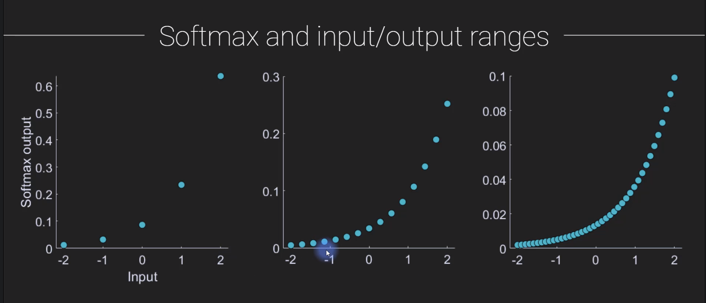

Jupyter Notebook (continuation):

```python
z = [1,2,3]
num = np.exp(z)
den = np.sum(np.exp(z))
sigma = num/den
sigma
```

array([0.09003057, 0.24472847, 0.66524096])

```python
z = np.random.randint(-5, high=15, size=25)
num = np.exp(z)
den = np.sum(np.exp(z))
out = num/den

fig, ax = plt.subplots()
ax.scatter(z, out)
ax.set(title="Plot of softmax input/output", xlabel="Original input(z)", ylabel="Softmaxed σ")
plt.show()
```

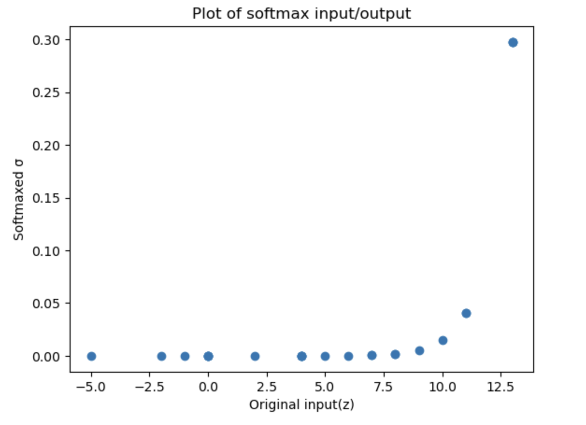

```python
z = [1,2,3]
# create an instance of softmax activation class
softfun = nn.Softmax(dim=0)
# then apply the data to that function
sigmaT = softfun(torch.Tensor(z)) 
# same for torch.tensor(z, dtype=torch.float)
print(sigmaT)
```

tensor([0.0900, 0.2447, 0.6652])

## Logarithms in math, numpy, and pytorch (Logarithms: Video 20)

The increase in y for values in x from 0.0 to 0.1 is very high compared to increase between higher consecutive increases in x. So, such graphs can be used to calculate small decrease/increase in probability in smaller values of x with smaller roundoff errors. 

Jupyter notebook (continuation):

```python
# The function np.linspace takes three arguments: the starting point of the sequence (0.0001 in this case), 
# the ending point of the sequence (1 in this case), and the number of elements to be generated in the 
# sequence (20 in this case).
x = np.linspace(0.0001, 1, 20)
lnx = np.log(x) # lnx

fig, ax = plt.subplots()
ax.plot(x, lnx, marker='x')
ax.set(xlabel='x', ylabel='lnx')
plt.show()
```

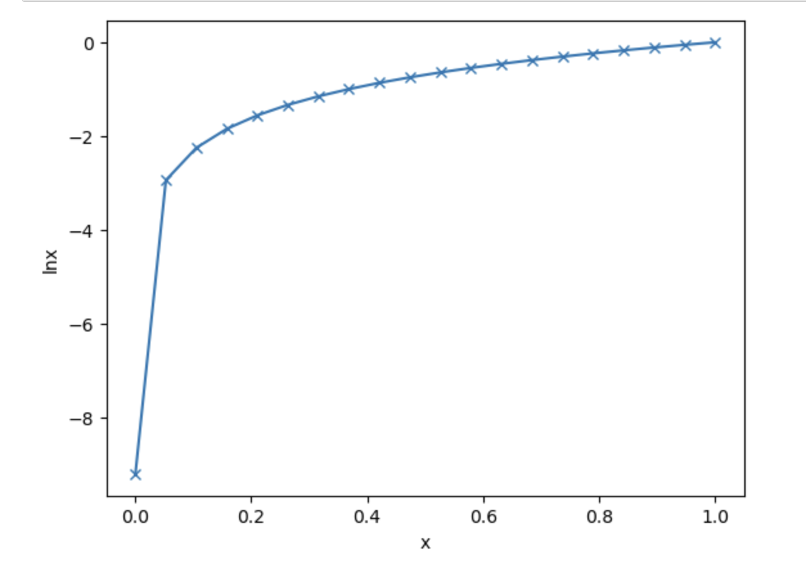

## Cross-entropy on math, numpy, and pytorch (Entropy and cross-entropy: Video 21)

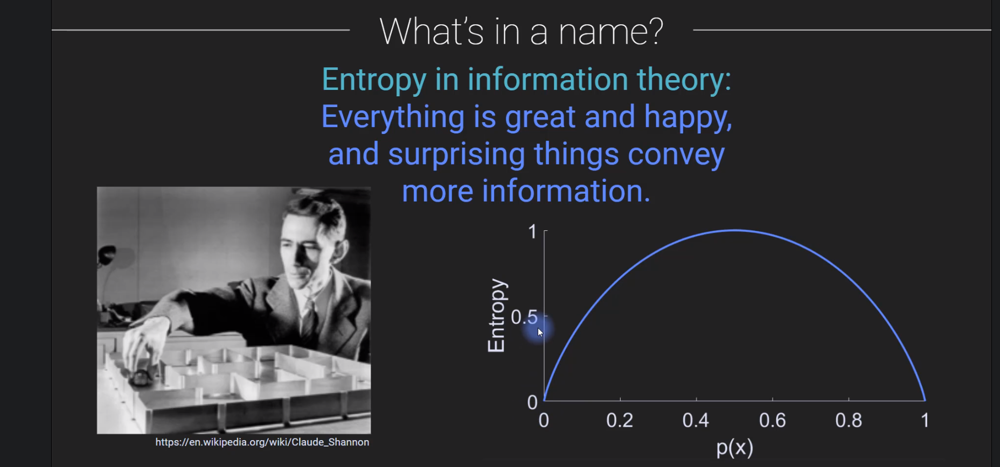

The graph can be represented as:

$H=-\sum^n_{i=1}p(x_i)log_2(p(x_i))$

$x$ = data values

$p$ = probability 

high entropy means dataset has a lot of variability (unpredictable)

low entropy means that most of the values of the dataset repeat and therefore are redundant

Cross-entropy describes the relationship between two probability distributions.

$H=-\sum p(x)log_2(q)$

Cross entropy in neural network tells the model how well the model does on all training examples

Jupyter notebook (continuation):

```python
# the probability of event happening is 0.25
# so the probability of it not happening is 1-0.25
x = [0.25, 0.75]
H = 0
for p in x:
  H += -p * np.log(p)
print(f'Cross Entropy: {H}')
```

Cross Entropy: 0.5623351446188083

Jupyter notebook (continuation):

```python
# actual probability, it is either a cat, p=1, or not cat,p=0 (not model's prediction)
p = [1, 0]
# model's prediction of being cat, 0.25, not cat, 0.75
q = [0.25, 0.75]
H = 0
for i in p:
    H += -p[i] * np.log(q[i])
print(f"Cross Entropy: {H}")
```

Cross Entropy: 1.3862943611198906

```python
p_tensor = torch.Tensor(p)
q_tensor = torch.Tensor(q)
# binary_cross_entropy takes params in this order: 
# (model predicted probability, actual probability)
F.binary_cross_entropy(q_tensor, p_tensor)
```

tensor(1.3863)

## min/max/argmin/argmax in numpy, and pytorch (Min/max and argmin/argmax: Video 22)

Jupyter notebook (continuation):

```python
M = np.array([[0, 1, 10], 
              [20, 8, 5]])
print(f"minimum values in each col: {np.min(M, axis=0)}")
print(f"minimum values in each row: {np.min(M, axis=1)}")

# argmin implies the positions/indices where min occurs,
# there is also argmax
print(f"minimum in each col pos: {np.argmin(M, axis=0)}")
print(f"minimum in each row pos: {np.argmin(M, axis=1)}")

# argmin for whole matrix
print(f"maximum in whole matrix: {np.argmax(M)}")
```

minimum in each col: [0 1 5]
minimum in each row: [0 5]
minimum in each col: [0 0 1]
minimum in each row: [0 2]
maximum in whole matrix: 3

Jupyter notebook (continuation):

```python
tensor_M = torch.Tensor(M)
min_in_cols = torch.min(tensor_M, axis=0)
print(f"minimum values in each col: {min_in_cols.values}")
print(f"minimum in each col pos: {min_in_cols.indices}")
```

minimum values in each col: tensor([0., 1., 5.])
minimum in each col pos: tensor([0, 0, 1])

## mean and variance in numpy, and pytorch (Mean and variance: Video 23)

Formula of mean: $x=\frac{1}{n} \sum^n_{i=1}x_i$

Formula of variance: $\sigma^2=\frac{1}{n-1} \sum^n_{i=1}(x_i-mean)^2$

Formula of standard deviation: $\sigma=\sqrt{variance}=\sqrt{\sigma^{2}}$

jupyter notebook (continuation):

```python
x = [1,2,4,6,5,4,0]
mean = np.mean(x)
var = np.var(x) # calculates 1/n instead of n-1
unbiased_var = 1/(len(x)-1) * np.sum((x-mean)**2) # unequal to above, equal to below
unbiased_var_numpy = np.var(x, ddof=1)
mean, var, unbiased_var, unbiased_var_numpy
```

(3.142857142857143, 4.122448979591836, 4.809523809523809, 4.809523809523809)

## sampling with python (Random sampling and sampling variability: Video 24)

Jupyter notebook (continuation):

```python
x = [1,2,4,6,5,4,0,-4,5,-2,6,10,-9,1,3,-6]
mean = np.mean(x)
sample = np.random.choice(x, size=5, replace=True)
sampmean = np.mean(sample)
mean, sampmean
```

(1.625, 3.8)

## Getting same random numbers in numpy, and pytorch (Reproducible randomness via seeding: Video 25)

jupyter notebook (continuation):

```python
np.random.seed(5) # older method
np.random.randn(5)
```

array([ 0.44122749, -0.33087015,  2.43077119, -0.25209213,  0.10960984])

```python
rand_seed1 = np.random.RandomState(17) # newer method
rand_seed2 = np.random.RandomState(20210530)

print(rand_seed1.randn(5))
print(rand_seed2.randn(5))
print(rand_seed1.randn(5))
print(rand_seed2.randn(5))
print(np.random.randn(5))
```

[ 0.27626589 -1.85462808  0.62390111  1.14531129  1.03719047]
[-0.24972681 -1.01951826  2.23461339  0.72764703  1.2921122 ]
[ 1.88663893 -0.11169829 -0.36210134  0.14867505 -0.43778315]
[ 1.15494929 -0.0015467  -0.11196868 -1.08136725  0.10265891]
[-0.70017904  1.15139101  1.85733101 -1.51117956  0.64484751]

```python
torch.manual_seed(5)
torch.randn(5)
```

tensor([-0.4868, -0.6038, -0.5581,  0.6675, -0.1974])

## (The t-test: Video 26)

We will do experimentations by changing parameters or by changing model architectures. But how do we determine that a set of parameters/model architecture is better than the others? The answer is to that is t-test. 

$t_k=\frac{\bar{x}-\bar{y}}{\frac{s}{\sqrt{n}}}$ = $\frac{MeanDifferences}{StandardDeviations}$

$\bar{x}$ : mean of x

$\bar{y}$ : mean of y

s: standard deviation

n: number of times the model is repeated

Jupyter notebook (continuation):

```python
n1 = 30 # number of samples in dataset 1
n2 = 40 # number of samples in dataset 2
mu1 = 1 # population mean in dataset 1
mu2 = 2 # population mean in dataset 2

# generate the data
data1 = mu1 + np.random.randn(n1)
data2 = mu2 + np.random.randn(n2)

# plot
fig, ax = plt.subplots()
# This sets the style of the markers to red circles ('o' stands for circle, 'r' stands for red color).
# markerfacecolor='w': This sets the color of the marker face to white.
ax.plot(np.zeros(n1), data1, 'ro', markerfacecolor='w', markersize=14)
ax.plot(np.ones(n2), data2, 'bs', markerfacecolor='w', markersize=14)
ax.set(xlim=[-1,2], xticks=[0,1], label=["Group 1", "Group 2"])
plt.show()
```

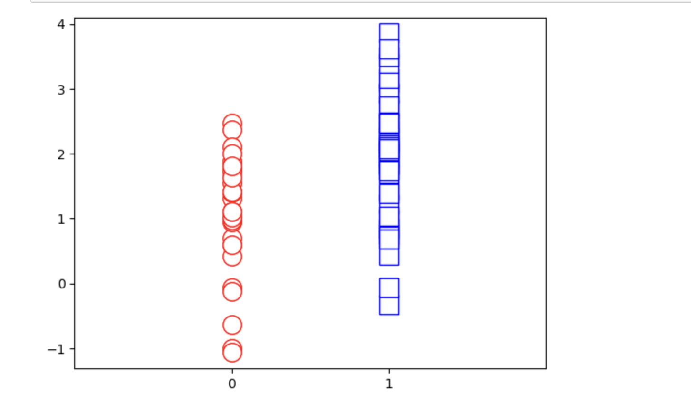

this tells us that group 2 has a larger mean than group 1, check the 2 cells below

Jupyter notebook (continuation):

```python
t, p = stats.ttest_ind(data1, data2)
t, p
```

(-3.7080548271443012, 0.0004220050531324407)

Jupyter notebook (continuation):

```python
t, p = stats.ttest_ind(data2, data1)
t, p
```

(3.7080548271443012, 0.0004220050531324407)

## Derivatives in sympy (Derivatives: intuition and polynomials: Video 27)

Why derivatives are needed for deep learning?

In Deep learning, the goal e.g classification is represented as an error function. Thus, the best solution is the point with the smallest error. 

The derivatives tells us the which way to move in that landscape in order to find the optimal solution.

Jupyter notebook (continuation):

```python
x = sym.symbols('x')
fx = 2*x**2
df = sym.diff(fx, x) # differentiate equation above
fx, df
```

(2*x**2, 4*x)

Jupyter notebook (continuation):

```python
symplot(fx, (x, -4, 4), title='The function')
plt.show()

symplot(df, (x, -4, 4), title='The derivative')
plt.show()
```

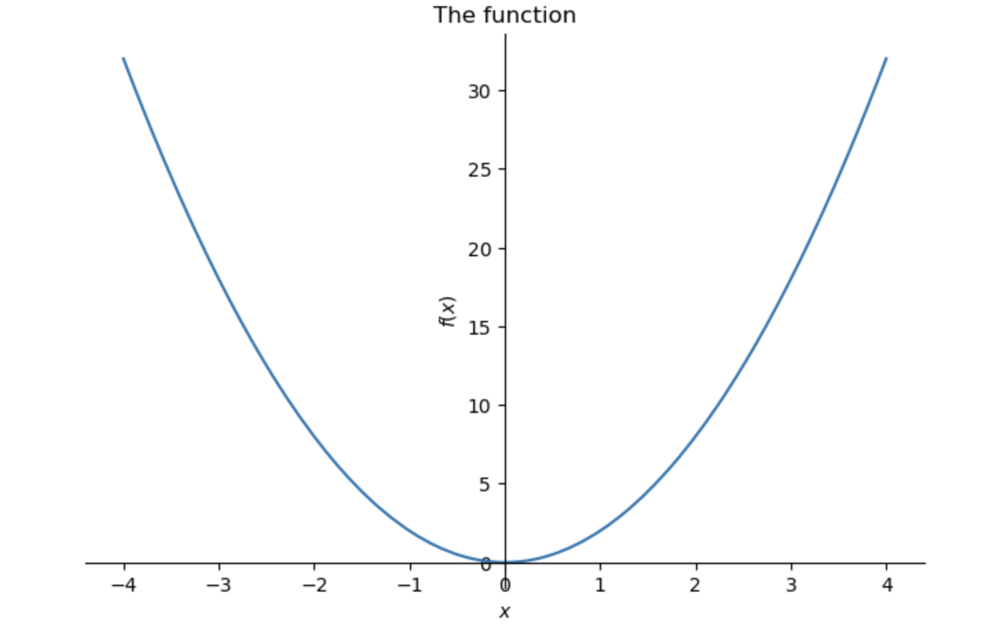

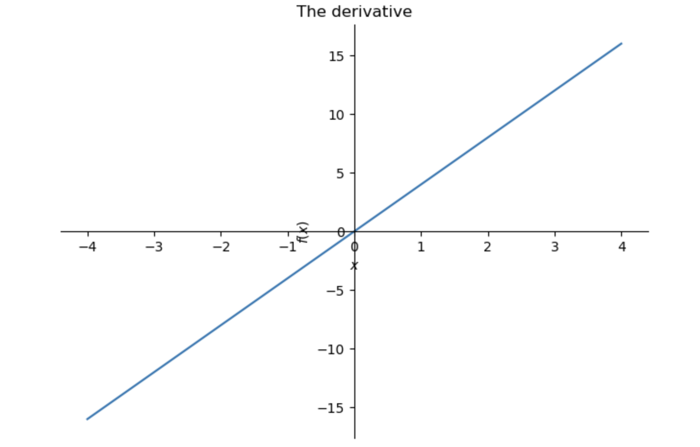

## (Derivatives find minima & Derivatives: product and chain rules: Video 28, 29)

We can use differentiation to find minimum and maximum points in a curve, where the differentiation = 0, but how to differentiate between maxima and minima?

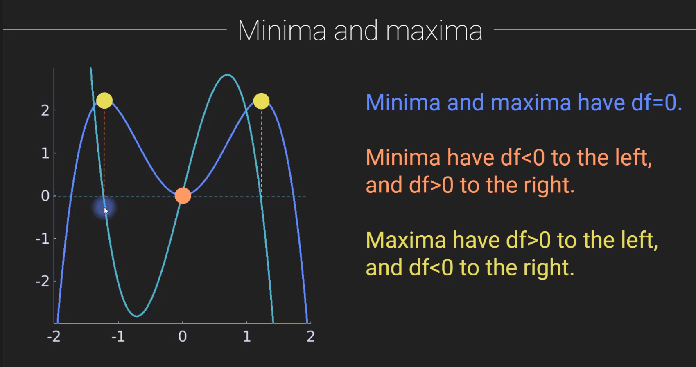

on the above graph, y-axis plots the derivative values, and the x-axis plots the x values.

Note: both local maxima/minima and global maxima/minima have differentiation = 0.

Examples of differentiation:

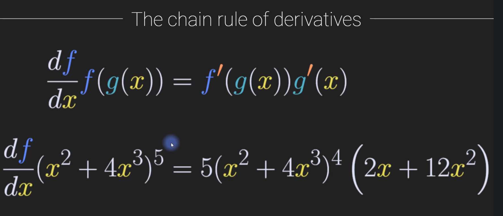

Jupyter notebook (continuation):

```python
x = sym.symbols('x')
fx = 2*x**2
gx = 4*x**3 - 3*x**4
df = sym.diff(fx)
dg = sym.diff(gx)

# product rule via sympy
prod_sym = sym.diff(fx*gx)
prod_sym
```

$2𝑥^2(−12𝑥^3+12𝑥^2)+4𝑥(−3𝑥^4+4𝑥^3)$

Jupyter notebook (continuation):

```python
gx = x**2 + 4*x**3
fx = (gx)**5

# chain rule via sympy
print('function: ')
display(fx)
print('derivative')
display(sym.diff(fx))
```

function: 

$(4𝑥^3+𝑥^2)^5$

derivative

$(60𝑥^2+10𝑥)(4𝑥^3+𝑥^2)^4$
